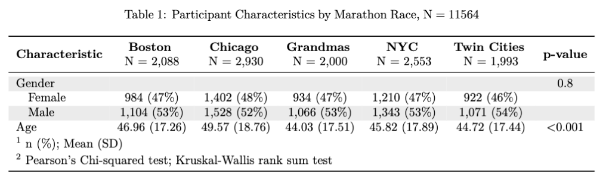
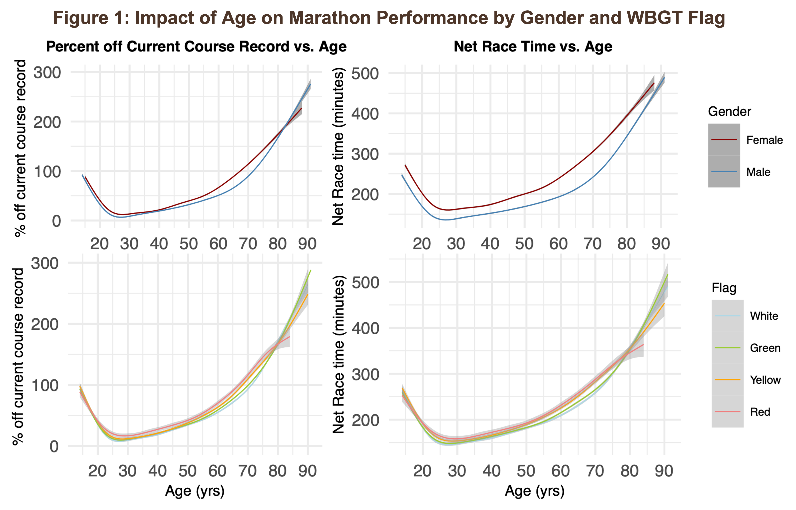
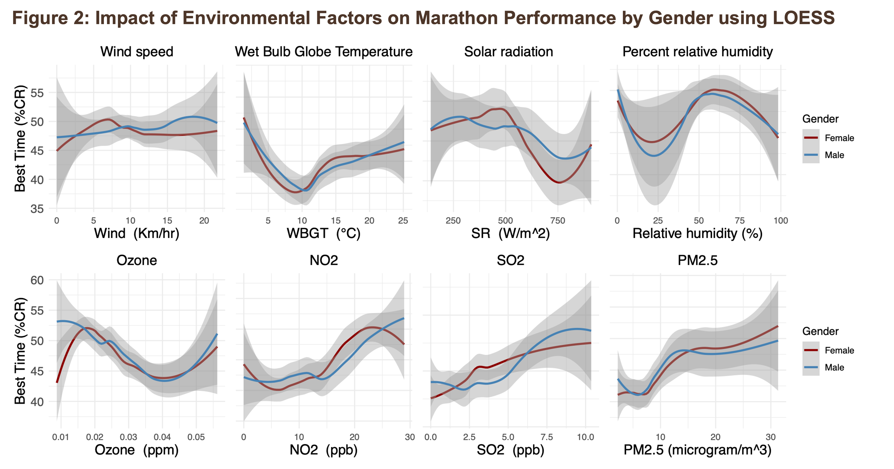
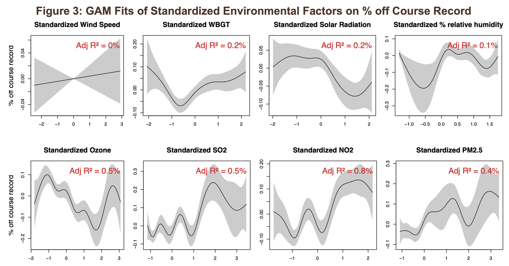
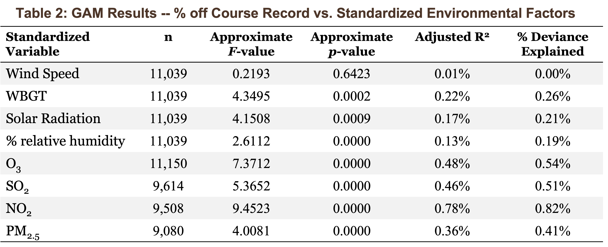

# PHP2550 Project 1: An exploratory data analysis

## Impacts of Weather on Marathon Performance across Age and Gender

## Objectives

This exploratory data analysis focused on the following 3 aims:

1.  Examine effects of increasing age on marathon performance in men and women;

2.  Explore the impact of environmental conditions on marathon performance, and whether the impact differs across age and gender;

3.  Identify the environmental parameters (WBGT, Flag conditions, temperature, air pollution etc) that have the largest impact on marathon performance.

## Methods

We analyzed the results of 96 major marathon events in the U.S. from 1993 to 2016. 

LOESS plots, Spearman correlation test, GAM with a Gamma family, LM with log transformed outcomes, and other supplementary analyses were performed to visualize and investigate the non-linear effects of age, weather conditions, i.e., Wet Bulb Globe Temperature (°C), wind speed (km/hr), solar radiation (W/m$^2$), percent relative humidity (%), and the concentrations of 4 criteria air pollutants: PM$_{2.5}$ ($\mu$g/m$^3$), SO$_2$ (ppm), NO$_2$ (ppm), and O$_3$ (ppb) on marathon performance for all runners and record holders across genders.

## Results and conclusion

Marathon performance exhibited a U-shaped relationship with age, where middle-aged runners (20-40 years old) performed best. This pattern was significantly modified by gender and moderately affected by WBGT Flag level. Environmental factors showed a relatively consistent impact between genders, but varied by age group. General runners aged 20–60 were relatively unaffected by environmental conditions, while younger and older runners showed greater sensitivity. 

Although several environmental factors were statistically associated with performance, no matter measured as % off course records and net race time for general runners or course records for top performers, the variability explained by the environmental factors were small, indicating limited practical impact. This suggests that environmental conditions, while statistically significant, may play a minimal role in determining overall marathon performance.   

## Directory Structure

**`0-american-statistical-association.csl`**: ASA citation style language file for citation formatting in the report file.

**`0-references.bib`**: the article bibliography for the main report.

**`1-aqi.R`**: to extract ambient air quality data from the US EPA Air Quality System Data Mart API for all relevant marathon dates and locations.

**`2-PHP2550-Project1Main.Rmd`**: the main EDA report Rmarkdown.

**`2-PHP2550-Project1Main.pdf`**: the knitted report as .pdf.

**`Main_Fig_Table`**: the sub-folder containing the most important figures and tables to be presented in this README

## Dependencies

The following packages were used in this analysis:

1)  Data extraction and manipulation: `tidyverse`, `RAQSAPI`

2)  Table formatting: `gt`, `gtsummary`, `knitr`, `kableExtra`

3)  Data visualization: `ggplot2`, `patchwork`, `naniar`

4)  Statistical analyses: `npreg`, `mosaic`, `mgcv`

5)  Citations: `knitcitations`

**Contributor**: Yanwei (Iris) Tong
