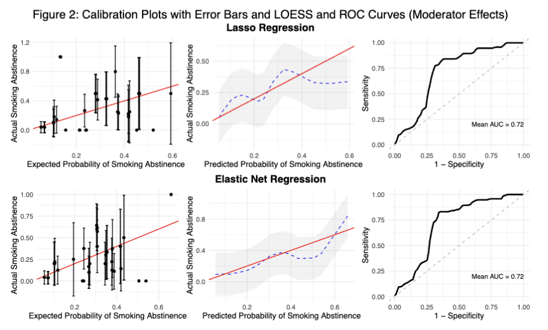

# PHP2550 Project 2: A regression data analysis

## Baseline Characteristics as Potential Moderators and Predictors of Smoking Cessation in Adults with Major Depressive Disorder

## Objectives

Building on a previous randomized, placebo-controlled study exploring factors influencing smoking cessation among adults with major depressive disorder (MDD), this project reexamined data from the same trial to accomplish the following two main objectives:

1)  to identify baseline variables that may moderate the impact of behavioral treatments on end-of-treatment (EOT) smoking abstinence,

2)  to evaluate baseline variables as predictors of abstinence outcomes, accounting for the effects of both behavioral treatments and pharmacotherapy.

## Methods

Missing data was imputed with MICE. Then, for each imputed data set, we applied logistic regression to model the binary smoking abstinence outcome and implemented two selection methods to identify moderating and predictive variables: lasso and elastic net regression with 10-fold cross-validation. Interaction terms were carefully incorporated, especially for factors hypothesized to moderate behavioral activation effects on abstinence. *Objective 1* included a comprehensive range of baseline variables and interaction terms with BA, while *Objective 2* focused solely on baseline predictors without interactions to assess their independent predictive effects. Calibration and discrimination metrics were used to evaluate model performance.

## Results and conclusion

Our analysis identified several key baseline characteristics as potential moderators and predictors for smoking cessation among individuals with MDD.

Interactions between BA and Nicotine Metabolism Ratio (NMR) suggested nuanced influences on cessation, potentially acting as moderators of treatment effects.  

For predictor effects, variables such as income level, race, FTCD score, and MDD history had certain impacts on odds of abstinence. In terms of model performance, Elastic Net achieved the best calibration metrics, with the lowest Brier score and calibration error, whereas bidirectional stepwise and best subset exhibited slightly higher AUC values, reflecting marginally better discrimination. 

## Directory Structure

**`0-american-statistical-association.csl`**: ASA citation style language file for citation formatting in the report file.

**`0-references.bib`**: the article bibliography for the main report.

**`1-PHP2550-Project2Main.Rmd`**: the main report Rmarkdown.

**`1-PHP2550-Project2Main.pdf`**: the knitted report as .pdf.

## Dependencies

The following packages were used in this analysis:

1)  Data extraction, manipulation, and imputation: `tidyverse`, `MASS`, `mice`, `naniar` , `caret`

2)  Table formatting: `gt`, `gtsummary`, `knitr`, `kableExtra`

3)  Data visualization: `ggplot2`, `patchwork`, `grid`, `gridExtra`, `patchwork`,`naniar`, `pROC`, `RColorBrewer`, `cowplot`

4)  Statistical analyses: `glmnet`

5)  Citations: `knitcitations`

**Contributor**: Yanwei (Iris) Tong
